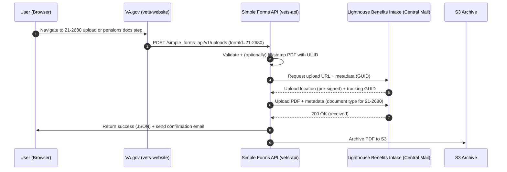

### Form 21-2680 on VA.gov — Implementation Overview

- **Purpose**: VA Form 21-2680, Examination for Housebound Status or Permanent Need for Regular Aid and Attendance
- **UX pattern on VA.gov**:
  - Users typically download the PDF and then upload it via the general "form upload" flow, or attach it as a supporting document in the pensions application.
  - The upload flow posts to the Simple Forms API, which forwards the document to the Lighthouse Benefits Intake API (Central Mail) and archives to S3.

### Frontend touchpoints

- **Simple Forms upload mapping** (includes 21-2680 label and official PDF):
  - File: `src/applications/simple-forms/form-upload/helpers/index.js`
  - Entry defines the label and `pdfDownloadUrl` for `21-2680` (Examination for Housebound Status or Permanent Need for Regular Aid and Attendance).
  - Example link: `https://www.va.gov/pubs/forms/VBA-21-2680-ARE.pdf`

- **Simple Forms routes** (generic uploader, 21-2680 supported):
  - File: `src/applications/simple-forms/form-upload/routes.jsx`
  - The dynamic `/:formId` routes mount a shared `App` container for the upload UX.

- **Pensions application — supporting documents** (references 21-2680):
  - File: `src/applications/pensions/config/chapters/06-additional-information/supportingDocuments.js`
  - The UI lists 21-2680 as an evidence document users may need to submit with the pensions application. This does not itself implement the upload; it informs the user and integrates with the application's document step.

- **Pensions Form Alerts** (user guidance mentions 21-2680 and related evidence):
  - File: `src/applications/pensions/components/FormAlerts/index.jsx`
  - Contains alerts that link to and reference the 21-2680 form page and upload instructions.

### Upload flow (high level)

- User selects "Upload form" (Simple Forms) for `21-2680` → frontend flow posts to Simple Forms API endpoint.
- Backend creates/stamps a submission PDF (for some forms) or validates provided PDF, associates a UUID, and calls the Lighthouse Benefits Intake API (Central Mail) with the document and metadata.
- On success, a confirmation email is sent and the file is archived to S3.

### Backend integration (Simple Forms API → Lighthouse Benefits Intake)

- **Controller**: `modules/simple_forms_api/app/controllers/simple_forms_api/v1/uploads_controller.rb`
  - Entry point: `submit` → for 21-2680, uses default path `submit_form_to_benefits_intake` (i.e., not the special ITF 21-0966 or LGY 26-4555 paths).
  - `validate_document_if_needed`: ensures PDF extension and validates content via `BenefitsIntakeService::Service.validate_document?` when required.
  - `prepare_for_upload` → requests an upload "location" and UUID from Lighthouse Benefits Intake, stamps PDF with the UUID, and records a `FormSubmissionAttempt`.
  - `perform_upload` → POSTs the document and metadata to Lighthouse (Central Mail). Attachments are only bundled for forms that support them; 21-2680 typically uploads as a single PDF.
  - On 200 OK, sends confirmation email and calls `upload_pdf_to_s3` for archival.

- **Document model and validation**: `app/models/lighthouse_document.rb`
  - Normalizes/validates the file (e.g., detects encryption, disallows non-PDF for certain paths, encodes text properly).
  - Maintains the Central Mail/Lighthouse document-type mapping; includes an entry for "VA Form 21-2680 — Examination for Housebound Status or Permanent Need for Regular Aid & Attendance," used to tag the submission appropriately.

- **Notification emails**: `modules/simple_forms_api/app/services/simple_forms_api/notification/form_upload_email.rb`
  - Sends "confirmation," "received," or "error" emails for uploads. 21-2680 falls under the Simple Forms coverage (templates and metadata assembled with form number, date submitted, etc.).

- **Where the document goes**
  - The Simple Forms API integrates with the Lighthouse Benefits Intake (Central Mail) API. Central Mail routes submissions into downstream VA repositories (e.g., VBMS or equivalent document stores) for adjudication workflows.
  - In addition, the API archives the final PDF to S3 (per VFF/S3 client configuration) for later retrieval/auditing.

### Sequence (end-to-end)

### Intermediate findings (key references)

- Frontend mapping and PDF link: `src/applications/simple-forms/form-upload/helpers/index.js`
- Frontend dynamic routes: `src/applications/simple-forms/form-upload/routes.jsx`
- Pensions supporting docs (references 21-2680): `src/applications/pensions/config/chapters/06-additional-information/supportingDocuments.js`
- Pensions alerts (references and instructions): `src/applications/pensions/components/FormAlerts/index.jsx`
- Upload controller (core flow): `modules/simple_forms_api/app/controllers/simple_forms_api/v1/uploads_controller.rb`
- Lighthouse document handling/mapping: `app/models/lighthouse_document.rb`
- Upload notification emails: `modules/simple_forms_api/app/services/simple_forms_api/notification/form_upload_email.rb`

### Next steps to complete a full deep-dive

- Inspect the Lighthouse Benefits Intake service client in vets-api for request/response schemas, endpoints, and exact metadata for 21-2680:
  - `modules/lighthouse/benefits_intake/service` (or equivalent service path)
- Confirm the exact document-type code used for 21-2680 in `LighthouseDocument::DOCUMENT_TYPES` and how it's chosen at runtime.
- Review PDF stamping details:
  - `SimpleFormsApi::PdfStamper` and `SimpleFormsApi::PdfFiller` behavior for uploads (UUID stamping, metadata overlay).
- Verify S3 archival configuration and bucket naming (VFF or S3 client configuration referenced by the controller's `upload_pdf_to_s3`).
- For pensions' in-app "supporting documents" flow, trace whether those uploads also funnel through Simple Forms API or a form-specific pipeline, and whether they ultimately use Benefits Intake as well.

### Notes

- Some forms use specialized backends (e.g., ITF 21-0966 or LGY 26-4555). Form 21-2680 uses the standard Benefits Intake path.
- Frontend text for pensions guides veterans to obtain 21-2680 and submit it as supporting evidence; the generic Simple Forms uploader also supports direct 21-2680 submissions.