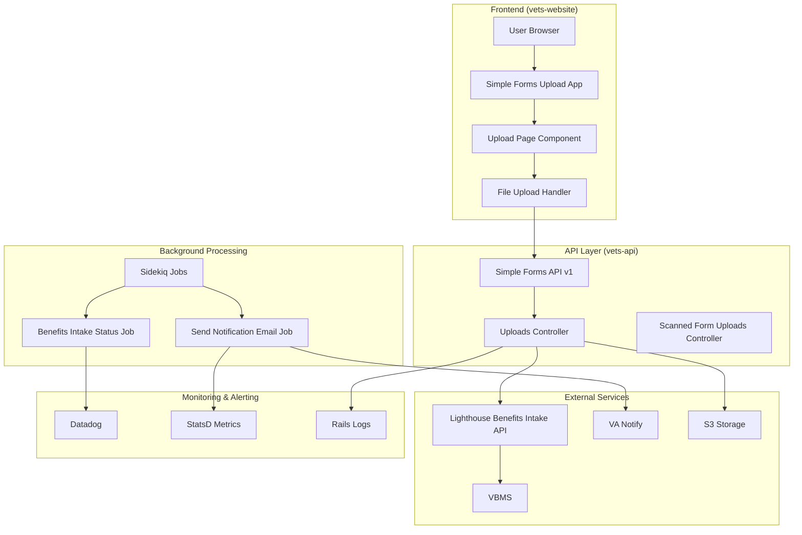
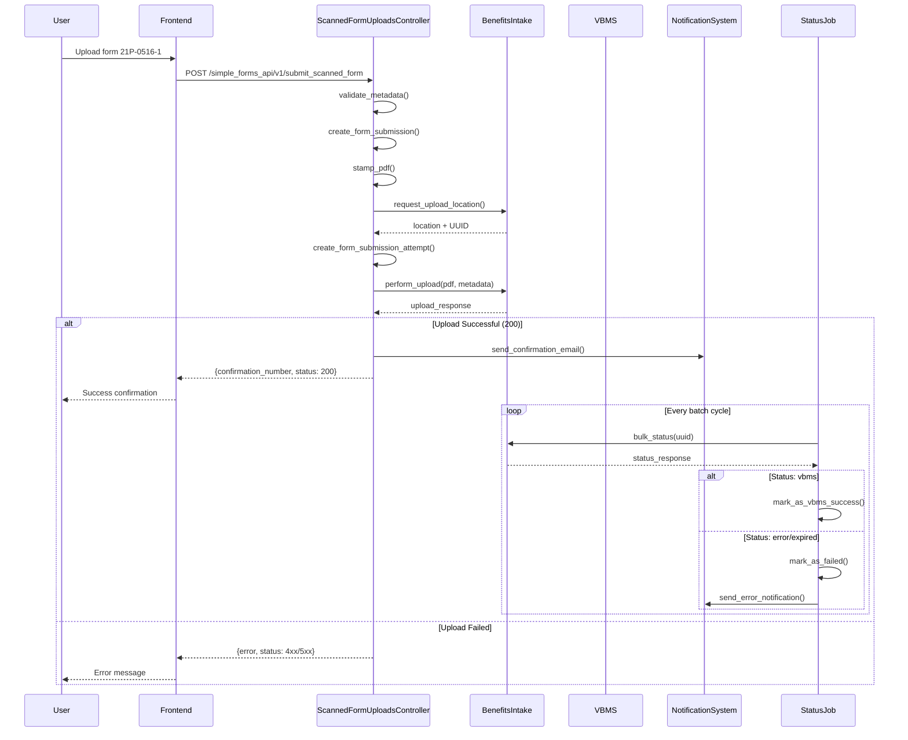
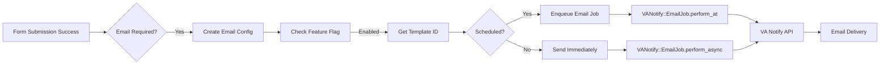

# Form 21P-0516-1 Upload Flow - Comprehensive Analysis

## Overview

This document provides a detailed analysis of the complete flow for form 21P-0516-1 (Survivors Pension) upload in the VA.gov platform, covering frontend interactions, backend processing, monitoring, alerting, retries, polling, and VA Notify integration.

## Form Information

- **Form Number**: 21P-0516-1
- **Form Type**: Survivors Pension 
- **System Mapping**: Maps to `vba_21p_0516_1` in the Simple Forms API
- **Authentication**: Requires authentication (not in UNAUTHENTICATED_FORMS list)
- **Processing Path**: Simple Forms API → Benefits Intake API → VBMS

## Architecture Overview

<div style="text-align: center;">



</div>

## Frontend Flow

### 1. Route Configuration

Based on the routes.jsx file, form 21P-0516-1 follows the standard simple forms pattern:

```javascript
// Path: /simple-forms-upload/:form_number
// Form 21P-0516-1 URL: /simple-forms-upload/21p-0516-1
```

### 2. User Journey

1. **Navigation**: User navigates to `/simple-forms-upload/21p-0516-1`
2. **Authentication**: System verifies user authentication (required for this form)
3. **Form Information**: System displays form information and upload instructions
4. **File Upload**: User selects and uploads their completed PDF form
5. **Validation**: Frontend validates file type, size, and other constraints
6. **Submission**: Frontend sends form data and file to backend API
7. **Confirmation**: User receives confirmation with tracking number

### 3. Frontend Components

```
src/applications/simple-forms/form-upload/
├── routes.jsx (routing configuration)
├── config/form.js (form-specific configuration)
├── helpers/index.js (utility functions)
├── containers/App.jsx (main app container)
└── pages/ (upload page components)
```

## Backend Flow - Detailed Analysis

### 1. API Endpoints

**Primary Controller**: `modules/simple_forms_api/app/controllers/simple_forms_api/v1/scanned_form_uploads_controller.rb`

#### API Routes Configuration:
```ruby
# modules/simple_forms_api/config/routes.rb
namespace :v1, defaults: { format: 'json' } do
  # Different controller - handles structured forms
  post '/simple_forms', to: 'uploads#submit'
  
  # CORRECT controller for form upload tool - handles scanned PDFs
  post '/submit_scanned_form', to: 'scanned_form_uploads#submit'
  post '/scanned_form_upload', to: 'scanned_form_uploads#upload_scanned_form'
end
```

#### Frontend Configuration:
```javascript
// Frontend submits to this endpoint
submitUrl: `${environment.API_URL}/simple_forms_api/v1/submit_scanned_form`
```

#### Key Methods:
- `submit` - Main form submission endpoint for scanned form uploads
- `upload_scanned_form` - File upload endpoint for scanned forms

**Important**: The form upload tool uses `scanned_form_uploads_controller.rb`, NOT `uploads_controller.rb`. The latter handles different form submission patterns.

### 2. Scanned Form Processing Pipeline

**Flow Overview**: Unlike structured forms that go through `uploads_controller.rb`, the form upload tool uses a different pattern specifically designed for scanned PDF submissions.



### 3. Scanned Form Submission Processing

**Key Difference**: The scanned form upload controller handles pre-filled PDFs differently than structured form data.

#### Metadata Creation (ScannedFormUploadsController)
```ruby
def validated_metadata
  raw_metadata = {
    'veteranFirstName' => params.dig(:form_data, :full_name, :first),
    'veteranLastName' => params.dig(:form_data, :full_name, :last),
    'fileNumber' => params.dig(:form_data, :id_number, :ssn) || 
                    params.dig(:form_data, :id_number, :va_file_number),
    'zipCode' => params.dig(:form_data, :postal_code),
    'source' => 'VA Platform Digital Forms',
    'docType' => params[:form_number],
    'businessLine' => 'CMP'
  }
  SimpleFormsApiSubmission::MetadataValidator.validate(raw_metadata)
end
```

#### PDF Stamping
```ruby
stamper = PdfStamper.new(stamped_template_path: file_path, 
                        current_loa: @current_user.loa[:current],
                        timestamp: Time.current)
stamper.stamp_pdf
```

#### Form Submission Creation
```ruby
FormSubmission.create(
  form_type: params[:form_number],
  form_data: params[:form_data].to_json,
  user_account: @current_user&.user_account
)
```

### 4. Benefits Intake Integration (Scanned Forms)

#### Upload Request Flow
```ruby
# 1. Prepare for upload - get location and UUID
def prepare_for_upload
  location, uuid = lighthouse_service.request_upload
  create_form_submission_attempt(uuid)
  [location, uuid]
end

# 2. Log upload details with Datadog tracing  
def log_upload_details(location, uuid)
  Datadog::Tracing.active_trace&.set_tag('uuid', uuid)
  Rails.logger.info('Simple forms api - preparing to upload scanned PDF to benefits intake', 
                    { location: location, uuid: uuid })
end

# 3. Perform upload with metadata
def perform_pdf_upload(location, file_path, metadata)
  lighthouse_service.perform_upload(
    metadata: metadata.to_json,
    document: file_path,
    upload_url: location
  )
end
```

## Monitoring & Alerting

### 1. Datadog Integration

**Tracing Configuration**:
```ruby
Datadog::Tracing.active_trace&.set_tag('form_id', params[:form_number])
Datadog::Tracing.active_trace&.set_tag('uuid', uuid)
```

**Dashboard**: Available at datadog dashboard link in BenefitsIntakeStatusJob

### 2. StatsD Metrics

**Key Metrics Tracked**:
```ruby
STATS_KEY = 'api.benefits_intake.submission_status'

# Metrics by form and status
StatsD.increment("#{STATS_KEY}.#{form_id}.#{result}")  # success/failure/stale/pending
StatsD.increment("#{STATS_KEY}.all_forms.#{result}")

# Service metrics
'service' => 'veteran-facing-forms'
'function' => "#{form_number} form submission to Lighthouse"
```

### 3. Logging

**Structured Logging Examples**:
```ruby
Rails.logger.info(
  'Simple forms api - sent to benefits intake',
  { form_number: params[:form_number], status: status, uuid: confirmation_number }
)

Rails.logger.error(
  'BenefitsIntakeStatusJob', 
  result: 'failure', 
  form_id: form_id, 
  uuid: uuid, 
  time_to_transition: time_to_transition, 
  error_message: error_message
)
```

## Retry Mechanisms & Error Handling

### 1. Sidekiq Job Retries

**Benefits Intake Status Job**:
```ruby
sidekiq_options retry: false  # No automatic retries for status polling
```

**Send Notification Email Job**:
```ruby
sidekiq_options retry: 10, backtrace: true  # 10 retries with full backtrace
```

### 2. Benefits Intake API Retry Logic

**No Built-in Retries**: The Benefits Intake service does not implement automatic retries in the upload process. Failed uploads return appropriate HTTP status codes.

**Error Handling**:
```ruby
rescue SimpleFormsApi::FormRemediation::Error => e
  Rails.logger.error('Simple forms api - error uploading form submission to S3 bucket', error: e)
  build_response(confirmation_number, presigned_s3_url, status)
end
```

### 3. Exception Handling

**Controller Level**:
```ruby
rescue Prawn::Errors::IncompatibleStringEncoding
  raise
rescue => e
  raise Exceptions::ScrubbedUploadsSubmitError.new(params), e
end
```

## Polling & Status Tracking

### 1. Benefits Intake Status Job

**Scheduled Execution**: Runs periodically via Sidekiq cron or manual trigger

**Processing Logic**:
```ruby
def perform
  pending_form_submission_attempts = FormSubmissionAttempt.where(aasm_state: 'pending')
                                                         .includes(:form_submission).to_a
  
  form_ids = BenefitsIntake::SubmissionStatusJob::FORM_HANDLERS.keys.map(&:to_s)
  pending_form_submission_attempts.reject! { |pfsa| form_ids.include?(pfsa.form_submission.form_type) }
  
  total_handled, result = batch_process(pending_form_submission_attempts)
end
```

**Batch Processing**:
```ruby
pending_form_submission_attempts.each_slice(batch_size) do |batch|
  batch_uuids = batch.map(&:benefits_intake_uuid)
  response = intake_service.bulk_status(uuids: batch_uuids)
  total_handled += handle_response(response)
end
```

### 2. Status States

**Form Submission Attempt States** (AASM):
- `pending` - Submitted to Benefits Intake, awaiting processing
- `vbms` - Successfully processed into VBMS
- `failure` - Failed processing with error

**Benefits Intake API Status Values**:
- `pending` - Still processing
- `vbms` - Successfully uploaded to VBMS
- `error` - Processing error occurred  
- `expired` - Upload window expired (15 minutes)

### 3. SLA Monitoring

**Stale Submission Tracking**:
```ruby
STALE_SLA = Settings.lighthouse.benefits_intake.report.stale_sla || 10  # days

if time_to_transition > STALE_SLA.days
  log_result('stale', form_id, uuid, time_to_transition)
end
```

## VA Notify Integration

### 1. Email Service Architecture

**Primary Service**: `modules/simple_forms_api/app/services/simple_forms_api/notification/email.rb`

**Template Management**:
```ruby
TEMPLATE_IDS = YAML.load_file(
  'modules/simple_forms_api/app/services/simple_forms_api/notification/template_ids.yml'
)
```

### 2. Notification Types

**Supported Notification Types**:
- `:confirmation` - Successful form submission
- `:received` - Form received and processing (for intent-based forms)
- `:error` - Processing failure
- `:rejected` - Form rejected
- `:duplicate` - Duplicate submission detected

### 3. Email Delivery Flow



### 4. Email Configuration

**Personalization Data**:
```ruby
def get_personalization
  config = { date_submitted: date_submitted, confirmation_number: confirmation_number, lighthouse_updated_at: lighthouse_updated_at }
  personalization = SimpleFormsApi::Notification::Personalization.new(form: form, config: config, expiration_date: expiration_date)
  personalization.to_hash
end
```

**Template Selection**:
```ruby
def template_id
  template_id_suffix = TEMPLATE_IDS[form_number][notification_type.to_s]
  @_template_id ||= Settings.vanotify.services.va_gov.template_id[template_id_suffix]
end
```

### 5. Feature Flags

**Email Feature Flags**:
```ruby
def flipper?
  number = form_number
  number = 'vba_21_0966' if form_number.start_with?('vba_21_0966')
  Flipper.enabled?(:"form#{number.gsub('vba_', '')}_confirmation_email")
end
```

### 6. Error Notification Handling

**Asynchronous Error Notifications**:
```ruby
# Triggered from BenefitsIntakeStatusJob on failure states
SimpleFormsApi::Notification::SendNotificationEmailJob.perform_async(
  benefits_intake_uuid, 
  form_number
)
```

**Time-based Delivery**:
```ruby
HOUR_TO_SEND_NOTIFICATIONS = 9  # 9 AM Eastern Time

def time_to_send
  now = Time.zone.now.in_time_zone('Eastern Time (US & Canada)')
  target_time = now.change(hour: HOUR_TO_SEND_NOTIFICATIONS, min: 0)
  
  now.hour < HOUR_TO_SEND_NOTIFICATIONS ? target_time : target_time.tomorrow
end
```

## S3 Storage Integration

### 1. Form Remediation Upload

**Conditional S3 Upload**:
```ruby
def upload_pdf_to_s3(id, file_path, metadata, submission, form)
  return unless %w[production staging test].include?(Settings.vsp_environment)
  
  config = SimpleFormsApi::FormRemediation::Configuration::VffConfig.new
  s3_client = config.s3_client.new(
    config: config, type: :submission, id: id, submission: submission, 
    attachments: attachments, file_path: file_path, metadata: metadata
  )
  s3_client.upload
end
```

### 2. Supporting Documents

**Document Validation**:
```ruby
def validate_document_if_needed(file_path)
  return true unless %w[40-0247 40-10007].include?(params[:form_id]) && 
                     File.extname(file_path).downcase == '.pdf'
  
  service = BenefitsIntakeService::Service.new
  service.valid_document?(document: file_path)
rescue BenefitsIntakeService::Service::InvalidDocumentError => e
  # Handle validation error
end
```

## Form-Specific Implementation Details

### 1. Form 21P-0516-1 Configuration

**Authentication Required**: Form 21P-0516-1 is **not** in the `UNAUTHENTICATED_FORMS` list, requiring user authentication.

**Form Number Mapping**:
```ruby
FORM_NUMBER_MAP = {
  '21P-0516-1' => 'vba_21p_0516_1'
}.freeze
```

### 2. Business Logic

**CMP Business Line**: All simple forms use 'CMP' (Compensation & Pension) as the business line in metadata.

**Document Type**: Set to the form number (e.g., '21P-0516-1') in Benefits Intake metadata.

**Source**: 'VA Platform Digital Forms' for all submissions.

## Error Handling & Monitoring

### 1. Common Error Scenarios

**Upload Failures**:
- PDF validation errors
- Benefits Intake API timeouts
- Invalid metadata format
- File size/type restrictions

**Processing Failures**:
- VBMS integration errors
- Expired upload windows (15 minutes)
- Duplicate submissions

### 2. Error Recovery

**Graceful Degradation**:
```ruby
def send_confirmation_email_safely(parsed_form_data, confirmation_number)
  send_confirmation_email(parsed_form_data, confirmation_number)
rescue => e
  Rails.logger.error('Simple forms api - error sending confirmation email', error: e)
end
```

**Silent Failure Tracking**:
```ruby
StatsD.increment('silent_failure', tags: stats_tags) if error_notification?
```

## Performance Considerations

### 1. File Size Limits

**Benefits Intake API Limits**:
```ruby
PDF_VALIDATOR_OPTIONS = {
  size_limit_in_bytes: 100_000_000, # 100 MB
  check_page_dimensions: true,
  check_encryption: true,
  width_limit_in_inches: 78,
  height_limit_in_inches: 101
}.freeze
```

### 2. Batch Processing

**Status Job Batching**:
```ruby
BATCH_SIZE = Settings.lighthouse.benefits_intake.report.batch_size || 1000

pending_form_submission_attempts.each_slice(batch_size) do |batch|
  # Process in batches to avoid API rate limits
end
```

## Security Considerations

### 1. PDF Stamping

**UUID Tracking**: All PDFs are stamped with UUIDs for tracking through the system without exposing sensitive data.

### 2. Data Validation

**Metadata Validation**: All form metadata is validated before submission to prevent injection attacks.

**File Validation**: PDFs are validated for format, encryption, and size before processing.

## Integration Points

### 1. External Systems

- **Lighthouse Benefits Intake API**: Primary upload destination
- **VBMS**: Final document storage system  
- **VA Notify**: Email notification service
- **MPI**: User profile information (for personalized emails)
- **S3**: Form backup and remediation storage

### 2. Internal Systems

- **Sidekiq**: Background job processing
- **Datadog**: Monitoring and alerting
- **StatsD**: Metrics collection
- **Rails Logger**: Application logging

## Controller Architecture Clarification

**Two Separate Form Processing Patterns**:
1. **`uploads_controller.rb`** - Handles structured form submissions via `/simple_forms` endpoint
2. **`scanned_form_uploads_controller.rb`** - Handles pre-filled PDF uploads via `/submit_scanned_form` endpoint

**Form 21P-0516-1 Flow**: Uses the scanned form upload pattern, where users upload completed PDFs rather than filling out forms online.

## Areas Not Fully Documented in Code

### 1. Unclear Implementation Details

1. **Form 21P-0516-1 Specific Class**: Could not locate the specific form class implementation
2. **Frontend Upload Components**: Specific upload page components were not accessible
3. **Template IDs Configuration**: The actual template_ids.yml file content was not visible
4. **Feature Flag Configuration**: Specific feature flag settings for form 21P-0516-1

### 2. External Service Details

1. **VA Notify API Integration**: Detailed API contract and response handling
2. **Benefits Intake API Rate Limits**: Specific rate limiting and throttling behavior
3. **VBMS Integration**: Final processing steps within VBMS
4. **S3 Bucket Configuration**: Specific bucket policies and access patterns

## Recommendations

### 1. Monitoring Improvements

- Add more granular metrics for form-specific error rates
- Implement alerting for stale submissions exceeding SLA
- Monitor Benefits Intake API response times and success rates

### 2. Error Handling

- Implement exponential backoff for Benefits Intake API retries
- Add circuit breaker pattern for external service calls
- Improve error message specificity for user-facing errors

### 3. Performance

- Consider implementing upload progress indicators for large files
- Add file upload resume capability for interrupted uploads
- Implement file compression for reduced upload times

---

*This analysis is based on code examination as of the current repository state. Implementation details may vary and should be verified against the actual running system.*
