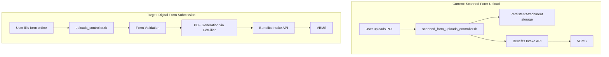

# Form 21P-0516-1: Digital Transformation Analysis

## Executive Summary

This document analyzes how to transform form 21P-0516-1 (Survivors Pension) from its current **scanned PDF upload model** to a **digital form submission model** where users fill out forms online. The analysis examines existing infrastructure that can be leveraged and identifies new components that need to be built.

## Current State vs Target State

### Current State: Scanned Form Upload
- **Controller**: `scanned_form_uploads_controller.rb`
- **Endpoint**: `/submit_scanned_form`
- **Process**: Two-step (upload PDF → submit metadata)
- **User Experience**: Upload pre-filled PDF documents

### Target State: Digital Form Submission
- **Controller**: `uploads_controller.rb` (existing)
- **Endpoint**: `/simple_forms` (existing)
- **Process**: Single-step structured data submission
- **User Experience**: Fill out form online with guided UI

## Architecture Comparison



## Detailed Analysis

### ✅ Components That Can Be Leveraged

#### 1. **Backend Infrastructure (80% Reusable)**

##### **Controller Layer**
- **`uploads_controller.rb`** - ✅ **Fully Reusable**
  - Already handles digital form submissions
  - Supports the `/simple_forms` endpoint
  - Has complete error handling and validation
  - Implements the single-step submission pattern

##### **Models & Services**
- **`BaseForm` class** - ✅ **Fully Reusable**
  ```ruby
  # Existing pattern that 21P-0516-1 can follow
  class SimpleFormsApi::Vba21p05161 < BaseForm
    # Form-specific logic here
  end
  ```

- **`PdfFiller` service** - ✅ **Fully Reusable**
  - Already handles dynamic PDF generation
  - Supports ERB template mapping
  - Includes stamping and metadata injection

- **Form Mapping System** - ✅ **Partially Reusable**
  - ERB template structure can be copied from existing forms
  - Field mapping logic is established
  - Need to create specific `vba_21p_0516_1.json.erb` mapping

##### **Integration Layer**
- **Benefits Intake Service** - ✅ **Fully Reusable**
  - Same API calls and flow
  - Same metadata validation
  - Same VBMS integration

- **Notification System** - ✅ **Fully Reusable**
  - Same VA Notify integration
  - Same email templates and patterns
  - Same confirmation flow

- **Monitoring & Observability** - ✅ **Fully Reusable**
  - Same Datadog metrics
  - Same structured logging
  - Same error tracking

##### **Job Processing**
- **Background Jobs** - ✅ **Fully Reusable**
  - Same Sidekiq job patterns
  - Same status polling mechanisms
  - Same retry strategies

#### 2. **Database Layer (90% Reusable)**
- **FormSubmission model** - ✅ **Fully Reusable**
- **FormSubmissionAttempt model** - ✅ **Fully Reusable**
- **Existing database schema** - ✅ **Fully Reusable**

### 🔨 Components That Need to Be Built

#### 1. **Form Model (New Development Required)**

**File**: `modules/simple_forms_api/app/models/simple_forms_api/vba_21p_0516_1.rb`

```ruby
module SimpleFormsApi
  class Vba21p05161 < BaseForm
    def metadata
      {
        'veteranFirstName' => @data.dig('veteran_full_name', 'first'),
        'veteranLastName' => @data.dig('veteran_full_name', 'last'),
        'fileNumber' => @data.dig('veteran_id', 'va_file_number').presence || 
                       @data.dig('veteran_id', 'ssn'),
        'zipCode' => @data.dig('claimant_address', 'postal_code'),
        'source' => 'VA Platform Digital Forms',
        'docType' => @data['form_number'],
        'businessLine' => 'CMP'  # Pension line
      }
    end

    def notification_first_name
      data.dig('claimant_full_name', 'first')
    end

    def notification_email_address
      data['claimant_email']
    end

    def zip_code_is_us_based
      @data.dig('claimant_address', 'country') == 'USA'
    end

    # Form-specific validation and data processing methods
    # Based on 21P-0516-1 specific requirements
  end
end
```

#### 2. **PDF Form Mapping (New Development Required)**

**File**: `modules/simple_forms_api/app/form_mappings/vba_21p_0516_1.json.erb`

```erb
{
  "F[0].Page_1[0].ClaimantFirstName[0]": "<%= form.data.dig('claimant_full_name', 'first') %>",
  "F[0].Page_1[0].ClaimantLastName[0]": "<%= form.data.dig('claimant_full_name', 'last') %>",
  "F[0].Page_1[0].SSN_First[0]": "<%= form.data.dig('claimant_id', 'ssn')&.[]0..2) %>",
  // ... Additional form field mappings based on PDF form structure
}
```

#### 3. **Frontend Digital Form Application (Major Development Required)**

**Required Components**:

##### **Application Structure**
```javascript
// src/applications/21p-0516-1/
├── config/
│   ├── form.js              // Form configuration
│   └── migrations.js        // Schema migrations
├── containers/
│   └── App.jsx             // Main application container
├── pages/
│   ├── introduction.jsx     // Introduction page
│   ├── veteran-information.jsx
│   ├── claimant-information.jsx
│   ├── military-history.jsx
│   ├── evidence-support.jsx
│   └── review-submit.jsx
└── manifest.json           // Application manifest
```

##### **Form Configuration**
```javascript
// Based on existing digital form patterns
const formConfig = {
  applicationRoot: 'survivors-pension-21p-0516-1',
  urlPrefix: '/',
  submitUrl: `${environment.API_URL}/simple_forms_api/v1/simple_forms`,
  trackingPrefix: 'survivors-pension-21p-0516-1-',
  transformForSubmit: transformForSubmit,
  formId: 'VBA-21P-0516-1',
  saveInProgress: {
    messages: {
      inProgress: 'Your survivors pension application (21P-0516-1) is in progress.',
      expired: 'Your saved survivors pension application (21P-0516-1) has expired.',
      saved: 'Your survivors pension application has been saved.'
    }
  },
  title: 'Apply for Survivors Pension',
  subTitle: 'Form 21P-0516-1',
  chapters: {
    // Chapter definitions for multi-page form
  }
};
```

#### 4. **Template & Static Assets (New Development Required)**

**Required Files**:
- PDF template: `modules/simple_forms_api/templates/vba_21p_0516_1.pdf`
- Form validation schemas
- Error message templates
- Success page templates

#### 5. **Route Configuration Updates (Minor Development)**

**Updates Required**:
```ruby
# modules/simple_forms_api/config/routes.rb
# Add form number mapping
FORM_NUMBER_MAP = {
  # ... existing forms
  'VBA-21P-0516-1' => 'vba_21p_0516_1'
}.freeze
```

### Implementation Strategy

#### Phase 1: Backend Foundation (2-3 weeks)
1. **Create Form Model** (`vba_21p_0516_1.rb`)
   - Implement metadata extraction
   - Add form-specific validation
   - Define notification methods

2. **PDF Template Integration**
   - Obtain official PDF template
   - Create form mapping file (`vba_21p_0516_1.json.erb`)
   - Test PDF generation

3. **Controller Integration**
   - Add form to FORM_NUMBER_MAP
   - Test with existing uploads_controller.rb
   - Verify Benefits Intake integration

#### Phase 2: Frontend Development (4-6 weeks)
1. **Application Scaffold**
   - Create application structure
   - Configure routing and manifest
   - Set up form configuration

2. **Page Development**
   - Build introduction and information pages
   - Implement form validation
   - Create review and submit flow

3. **Integration Testing**
   - Test full submission flow
   - Verify PDF generation
   - Test notification system

#### Phase 3: Testing & Deployment (2-3 weeks)
1. **End-to-End Testing**
2. **Performance Testing**
3. **Accessibility Compliance**
4. **Production Deployment**

### Technical Considerations

#### **Data Validation**
```ruby
# Form-specific validation requirements
def validate_survivors_pension_data
  validates_presence_of :claimant_full_name
  validates_presence_of :veteran_full_name
  validates_presence_of :veteran_date_of_death
  validates_format_of :claimant_ssn, with: /\A\d{9}\z/
  # Additional pension-specific validations
end
```

#### **Business Logic**
- Pension-specific eligibility checks
- Income/asset verification flows
- Military service validation
- Dependency relationship verification

#### **Form Schema Example**
```javascript
// Simplified schema structure
const schema = {
  type: 'object',
  properties: {
    veteranInformation: {
      type: 'object',
      properties: {
        fullName: { $ref: '#/definitions/fullName' },
        dateOfDeath: { $ref: '#/definitions/date' },
        militaryService: { $ref: '#/definitions/militaryService' }
      }
    },
    claimantInformation: {
      type: 'object',
      properties: {
        fullName: { $ref: '#/definitions/fullName' },
        relationship: { $ref: '#/definitions/relationship' },
        address: { $ref: '#/definitions/address' }
      }
    }
  }
};
```

### Risk Assessment

#### **Low Risk (Existing Infrastructure)**
- ✅ Backend controller and API endpoints
- ✅ PDF generation and form mapping
- ✅ Benefits Intake integration
- ✅ Notification and monitoring systems

#### **Medium Risk (Adaptation Required)**
- ⚠️ Form-specific business logic
- ⚠️ PDF template field mapping accuracy
- ⚠️ Form validation complexity

#### **High Risk (Net New Development)**
- 🚨 Frontend application development
- 🚨 User experience design
- 🚨 Accessibility compliance
- 🚨 Form schema definition

### Resource Requirements

#### **Development Team**
- **Backend Developer**: 20% allocation (leveraging existing infrastructure)
- **Frontend Developer**: 80% allocation (new application development)  
- **UX Designer**: 60% allocation (form design and user flows)
- **QA Engineer**: 40% allocation (testing and validation)

#### **Timeline Estimate**
- **Total Development**: 8-12 weeks
- **Backend Work**: 2-3 weeks
- **Frontend Work**: 4-6 weeks
- **Testing & Deployment**: 2-3 weeks

### Success Metrics

#### **Technical Metrics**
- Form submission success rate > 95%
- PDF generation success rate > 99%
- Average page load time < 2 seconds
- Form completion rate > 70%

#### **Business Metrics**
- Reduced processing time vs. scanned forms
- Improved data accuracy
- Enhanced user satisfaction scores
- Decreased support requests

## Conclusion

**The transformation from scanned form upload to digital form submission is highly feasible**, with approximately **80% of the backend infrastructure already in place**. The existing Simple Forms API architecture provides a solid foundation that can be leveraged with minimal modification.

**Key Advantages of Leveraging Existing Infrastructure**:
1. **Proven stability** - Uses battle-tested components
2. **Consistent user experience** - Follows established VA.gov patterns
3. **Reduced development time** - Focus effort on form-specific logic
4. **Lower maintenance overhead** - Reuses existing monitoring and support systems

**Primary Development Focus Areas**:
1. **Form Model Creation** (20% effort) - New business logic implementation
2. **Frontend Application** (60% effort) - Complete new user interface
3. **PDF Mapping** (15% effort) - Template integration and field mapping
4. **Testing & Integration** (5% effort) - Validation and deployment

The recommended approach is to **prioritize backend foundation first**, ensuring the form model and PDF generation work correctly, then **focus on frontend development** to create an intuitive and accessible user experience that matches VA.gov design standards.
