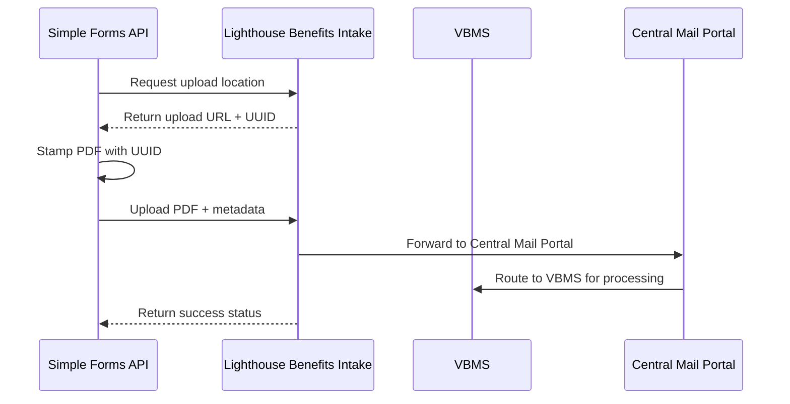
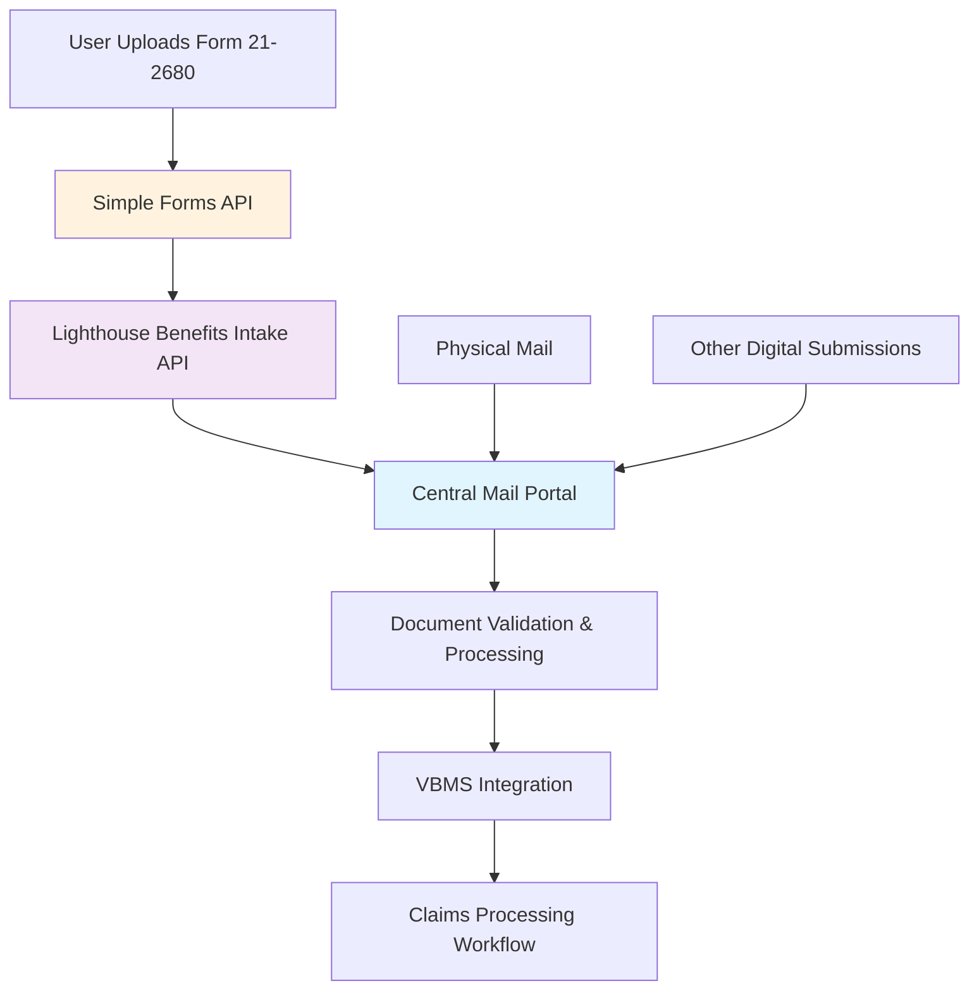

# Lighthouse Benefits Intake API and Central Mail Portal (CMP)

## Executive Summary

This document provides a comprehensive analysis of the Lighthouse Benefits Intake API and Central Mail Portal (CMP), which serve as critical infrastructure components in the VA's document processing ecosystem. These systems enable digital submission and automated processing of claim documents, ultimately improving service delivery to Veterans.

## Lighthouse Benefits Intake API

### Overview

The Lighthouse Benefits Intake API, formerly known as the VBA Document Upload Service, enables authorized third-party systems, such as those used by Veterans Service Organizations (VSOs), to upload scanned PDF claim documents directly to the Veterans Benefits Management System (VBMS). This API streamlines the claims intake process by reducing reliance on paper submissions and expediting processing times.

### Key Features

- **Document Submission**: Allows for the digital submission of various claim documents, eliminating the need for mailing or faxing
- **Status Tracking**: Enables users to check the status of their submissions to ensure they have been received and are being processed
- **Integration with VBMS**: Directly interfaces with the VBMS, ensuring that submitted documents are promptly available for claims processing
- **PDF Validation**: Comprehensive validation including size limits, page dimensions, encryption checks, and content verification
- **Bulk Operations**: Support for bulk status checking and document downloads

### Technical Implementation

#### Core Service Architecture

The Lighthouse Benefits Intake service is implemented as a Ruby service class that acts as a proxy to the external Lighthouse API:

**File**: `lib/lighthouse/benefits_intake/service.rb`
- **Base Class**: `Common::Client::Base`
- **Configuration**: Uses `BenefitsIntake::Configuration` for API settings
- **Purpose**: Proxy service for submitting claims that cannot be auto-established via electronic PDF submission to Central Mail Portal (CMP)

#### Key Methods and Functionality

1. **Upload Process**:
   ```ruby
   def perform_upload(metadata:, document:, attachments: [], upload_url: nil)
   ```
   - Validates and uploads documents with metadata
   - Supports multiple attachments
   - Handles multipart form data uploads

2. **Upload Location Management**:
   ```ruby
   def request_upload(refresh: false)
   ```
   - Requests upload location and UUID from Lighthouse
   - Caches location for reuse unless refresh is requested

3. **Status Tracking**:
   ```ruby
   def get_status(uuid:)
   def bulk_status(uuids:)
   ```
   - Individual and bulk status checking capabilities
   - Returns processing status for submitted documents

4. **Document Validation**:
   ```ruby
   def valid_document?(document:)
   ```
   - PDF validation with comprehensive checks:
     - Size limit: 100MB maximum
     - Page dimensions: Width ≤ 78 inches, Height ≤ 101 inches
     - Encryption detection and rejection
     - Content integrity validation

#### Configuration and Settings

**File**: `lib/lighthouse/benefits_intake/configuration.rb`
- **Authentication**: API key-based authentication via `lighthouse.benefits_intake.api_key`
- **Endpoints**: Configurable host, path, and version settings
- **Timeouts**: Configurable read timeout (default 30 seconds)
- **Circuit Breakers**: Error threshold at 80% over a two-minute period
- **Mock Support**: Configurable mock data usage for lower environments

#### API Endpoints

The API provides endpoints for:

- **Document Upload**: `POST /uploads` - Submit claim documents in PDF format
- **Upload Location**: `POST /uploads` - Get pre-signed upload URL and tracking UUID
- **Status Check**: `GET /uploads/{uuid}` - Retrieve the current status of submitted documents
- **Bulk Status**: `POST /uploads/report` - Check status of multiple submissions
- **Document Download**: `GET /uploads/{uuid}/download` - Download processed documents as ZIP
- **Document Validation**: `POST /uploads/validate_document` - Validate document before submission

### Authentication and Access

- **API Key Required**: Access requires obtaining an API key through a formal application process
- **Sandbox Environment**: Users can access a sandbox environment before moving to production
- **Developer Portal**: Available at [VA Developer Portal](https://developer.va.gov/explore)

### Integration Points

#### With Simple Forms API

The Lighthouse Benefits Intake API is primarily accessed through the Simple Forms API upload controller:

**File**: `modules/simple_forms_api/app/controllers/simple_forms_api/v1/uploads_controller.rb`
- **Standard Path**: Form 21-2680 uses the default `submit_form_to_benefits_intake` method
- **Specialized Paths**: Some forms (ITF 21-0966, LGY 26-4555) have custom handling
- **Process Flow**:
  1. `validate_document_if_needed` - PDF validation
  2. `prepare_for_upload` - Request upload location and stamp PDF with UUID
  3. `perform_upload` - POST document and metadata to Lighthouse
  4. Success handling - Send confirmation email and archive to S3

#### Document Processing Pipeline



## Central Mail Portal (CMP)

### Overview

The Central Mail Portal is a modernized platform designed to automate and integrate the end-to-end centralized mail intake, conversion, and handling processes. Its primary goal is to increase efficiencies, improve processing speed, and prevent backlogs in Veterans' benefits claims and appeals processing.

### Key Features

- **Automated Processing**: Automates key processes related to mail intake and conversion
- **Integration**: Fully integrates with existing systems to streamline workflow management
- **Secure Access**: Provides a centralized, secure resource for authorized end-users to retrieve converted documents for processing
- **Document Routing**: Routes submissions into downstream VA repositories (VBMS or equivalent document stores) for adjudication workflows
- **Format Conversion**: Handles conversion of both digital and physical mail into standardized formats

### Document Types and Routing

**File**: `app/models/lighthouse_document.rb`
- Maintains Central Mail/Lighthouse document-type mapping
- Includes entry for "VA Form 21-2680 — Examination for Housebound Status or Permanent Need for Regular Aid & Attendance"
- Tags submissions with appropriate document types for proper routing

### Processing Capabilities

1. **Digital Submissions**: Processes documents submitted via Lighthouse Benefits Intake API
2. **Physical Mail**: Handles scanning and digitization of paper submissions
3. **Quality Assurance**: Validates document integrity and completeness
4. **Metadata Extraction**: Extracts and standardizes document metadata
5. **Workflow Routing**: Routes documents to appropriate processing teams based on form type

## Integration Between Lighthouse Benefits Intake API and CMP

### Complementary Roles

The Lighthouse Benefits Intake API and Central Mail Portal serve complementary roles in the VA's document processing ecosystem:

- **Lighthouse Benefits Intake API**: Facilitates the digital submission of claim documents by external entities, ensuring that documents are received in a standardized digital format
- **Central Mail Portal**: Manages the intake, conversion, and handling of both digital and physical mail, ensuring that all documents, regardless of origin, are processed efficiently and integrated into the VA's claims processing systems

### End-to-End Document Flow



### Data Flow and Processing

1. **Digital Submission Path**:
   - Form uploaded via VA.gov Simple Forms interface
   - Simple Forms API validates and processes upload
   - Document forwarded to Lighthouse Benefits Intake API
   - Lighthouse stamps document with tracking UUID
   - Central Mail Portal receives and processes document
   - Document routed to VBMS for claims adjudication

2. **Status Tracking**:
   - Each step generates tracking information
   - Status updates available through Lighthouse API
   - Email notifications sent to submitters
   - Audit trail maintained in S3 archive

### Benefits of Integration

By leveraging both systems, the VA enhances its ability to process claims swiftly and accurately, ultimately improving service delivery to Veterans:

- **Reduced Processing Time**: Digital submissions eliminate mail handling delays
- **Improved Accuracy**: Automated validation reduces data entry errors
- **Enhanced Tracking**: Real-time status updates improve transparency
- **Scalability**: API-based architecture supports high-volume processing
- **Standardization**: Consistent document formatting and metadata

## Monitoring and Reliability

### Performance Metrics

- **StatsD Integration**: Metrics collected with prefix `api.benefits_intake`
- **Circuit Breakers**: Automatic failover at 80% error rate over 2-minute periods
- **Timeout Management**: Configurable timeouts with 30-second default
- **Health Checks**: Regular status monitoring of API endpoints

### Error Handling

- **Validation Errors**: Comprehensive PDF validation with detailed error messages
- **Upload Failures**: Retry mechanisms and error reporting
- **Status Monitoring**: Bulk status checking for operational oversight
- **Logging**: Detailed audit trails for troubleshooting

### Security Considerations

- **API Key Authentication**: Secure access control
- **Document Validation**: Prevents malicious file uploads
- **Encryption Detection**: Rejects encrypted documents that cannot be processed
- **Access Controls**: Role-based access to different API functions

## Developer Resources

### Documentation

- **API Specifications**: Available at [VA Developer Portal](https://developer.va.gov/explore/api/benefits-intake/docs)
- **Sample Clients**: Reference implementations in [vets-api-clients repository](https://github.com/department-of-veterans-affairs/vets-api-clients)
- **Endpoint Monitoring**: [Platform Documentation](https://depo-platform-documentation.scrollhelp.site/developer-docs/endpoint-monitoring)

### Development Support

- **Sandbox Environment**: Testing environment for development
- **Mock Data**: Configurable mock responses for development
- **Code Examples**: Ruby client implementation examples
- **Error Codes**: Standardized error responses with troubleshooting guidance

## Future Considerations

### Scalability and Enhancement

- **Volume Capacity**: Designed to handle increasing submission volumes
- **API Versioning**: Backward-compatible API updates
- **Feature Expansion**: Potential for additional document types and processing capabilities
- **Integration Points**: Expanding integration with other VA systems

### Operational Excellence

- **Performance Optimization**: Continuous monitoring and improvement
- **Reliability Engineering**: Redundancy and failover capabilities
- **User Experience**: Streamlined submission and tracking processes
- **Compliance**: Adherence to federal security and privacy requirements

## Conclusion

The Lighthouse Benefits Intake API and Central Mail Portal represent a modern, efficient approach to document processing within the VA ecosystem. Their integration provides a seamless experience for digital document submission while maintaining the ability to handle traditional paper-based submissions. This dual capability ensures comprehensive coverage of Veteran needs while improving processing efficiency and reducing administrative burden.

The technical implementation demonstrates best practices in API design, including comprehensive validation, robust error handling, and extensive monitoring capabilities. As the VA continues to modernize its digital services, these systems serve as foundational infrastructure supporting improved Veteran experiences and operational efficiency.